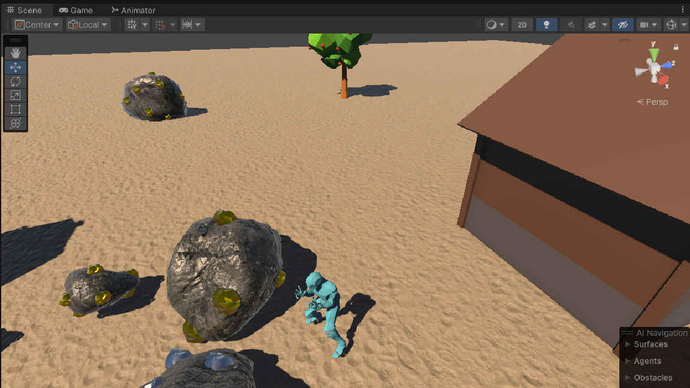

# Frontier-Pioneers - fresh repository
Frontier Pioneers is a 3d game made in Unity focused on village building and resource gathering.

## In Development 
The current goal is to import and refactor systems from the prototype version (which repo is private).

  